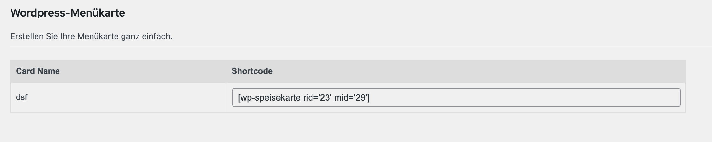

<h1 align="center">
  WP speisekarte
</h1>

    Speisekarte-erstellen ist simpel und schnell zu bedienen. Gestalten Sie Ihre eigene Speisekarte kostenfrei in wenigen Sekunden und verabschieden Sie sich von lästigen Papierkarten. Bieten Sie Ihren Gästen die Möglichkeit Ihre Karte über Ihre Website zu finden oder lassen als QR Code in Ihrem Restaurant.

Erstellen Sie verschiedenste Speisekarten über www.speisekarte-erstellen.de und importieren sie diese in wenigen Sekunden mittels des Wordpress-Plugins. 

## Funktionen:
<ul>
<li>
- Das Wordpress-Plugin und die Software von www.speisekarte-erstellen.de stehen beide kostenfrei zur Verfügung. 
</li>
<li>
- Gestaltete Speisekarten lassen sich mittels des Wordpress-Plugin in wenigen Sekunden auf Ihre Website importieren
</li>
<li>
- Sie können jederzeit Änderungen an Ihren Karten vornehmen, die dann auf der Website übernommen werden
</li>
<li>
- Jedes Produkt kann mit einem individuellen Text und Bild abgebildet werden. So können Sie auch Allergene und Nährwerte angeben. 
</li>
</ul>
 

    

    

Speisekarte-erstellen is simple and fast to use. Create your own menu free of charge in a few seconds and say goodbye to annoying paper menus. Offer your guests the possibility to find your menu on your website or leave it as a QR code in your restaurant.

Create various menus via www.speisekarte-erstellen.de and import them in a few seconds using the wordpress plugin. 

## Features

- The wordpress plugin and the software from www.speisekarte-erstellen.de are both available for free. 
- Designed menus can be imported to your website in a few seconds using the wordpress plugin
- You can make changes to your cards at any time and they will be applied to the website
- Each product can be displayed with an individual text and image. This way you can also specify allergens and nutritional values. 

